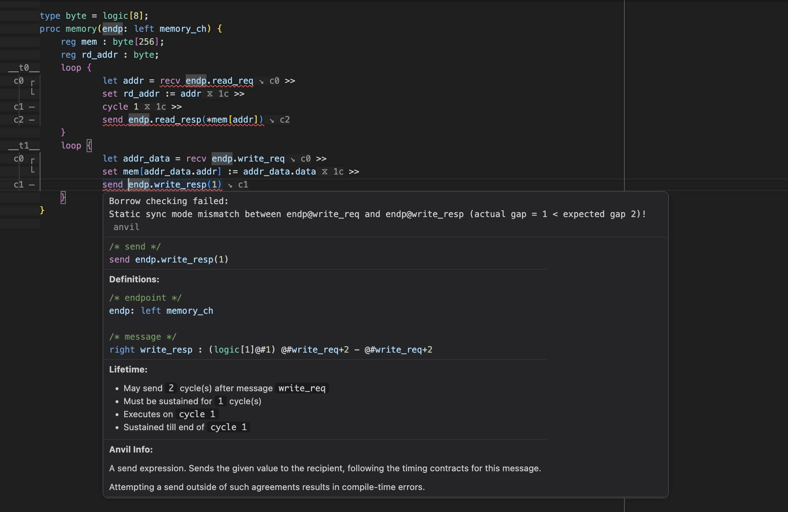

# anvil-lsp

[Anvil](https://github.com/kisp-nus/anvil) [Language Server Protocol (LSP)](https://microsoft.github.io/language-server-protocol/) implementation, including prepared extensions for supported editors.



## Requires

- Anvil [`6199e2b` or later](https://github.com/wxwern/anvil/tree/add-annotated-ast-output) with **experimental AST output** support. For best results, you may use the pinned version included as a submodule in this repository.

- [Node.js](https://nodejs.org/en) version 22 or later.

To install the language server, view the [installation instructions](#language-server-installation) for your editor of choice.

To install a supported version of Anvil, view the [Anvil installation instructions](#anvil-installation).

If you want to develop or maintain this repository, see the [maintainer guide](MAINTAINERS.md).

---

## Feature Support

- [x] Inline Diagnostics
    - Compile Errors
    - Compile Warnings^
- [x] Hover Information
    - Implementation
    - Definitions and types
    - Lifetimes and timings^
    - Anvil syntax help
- [x] Go to Definition
- [x] Go to Type Definition^
- [x] Find All References*
    - *Only works within the same file at the moment.
- [x] Signature Help
- [x] Autocompletion
    - Anvil keywords
    - Document symbols
    - Context-aware suggestions
    - Snippets
- [x] Inlay Hints
    - Lifetime and timings^
        - Clock Cycle indicators^
        - Lifetime indicators^
- [ ] Rename/Refactor symbol

For details, see the [LSP feature support documentation](LSP.md).

^Compiler support is incomplete and may not be available or accurate.

**Warning:** Both the Anvil Compiler AST output and Language Server implementations are currently experimental.
They may have bugs and the AST API are subject to breaking changes. Use with caution.

---

## Language Server Installation

Extensions are experimental. They automatically integrate syntax highlighting and LSP support for Anvil files.

Available extensions for supported editors are included in the `extensions` folder.

- [VSCode](#vscode)
- [Vim/Neovim (`coc.nvim`)](#vimneovim-cocnvim)


### VSCode

1. Clone this repository, and build the extension:
    ```bash
    git clone https://github.com/wxwern/anvil-lsp.git
    cd anvil-lsp/extensions/vscode
    npm install
    npm run build
    ```

2. Open the Command Palette with `Ctrl/Cmd + Shift + P`.

3. Select **"Developer: Install Extension from Location..."**.

4. Navigate to this repository, then into `extensions`, and then `vscode`.

5. Select **"Open"** to install the extension.


### Vim/Neovim (coc.nvim)

This requires `coc.nvim` for out-of-the-box LSP support.

Use your favorite Vim/Neovim plugin manager to download, build and install the extension.
For example, with `vim-plug`:

1. Add the following to your `.vimrc` or `init.vim`:
    ```vim
    Plug 'wxwern/anvil-lsp', {
        \ 'rtp': 'extensions/vim',
        \ 'do': 'cd extensions/vim && npm install && npm run build'
        \ }
    ```
2. Restart Vim/Neovim, then run:
    ```vim
    :PlugInstall
    ```

<details>
    <summary>Manual installation</summary>

If you prefer to manage it manually (still requires `coc.nvim`):

1. Clone this repository, and build the extension:
    ```bash
    git clone https://github.com/wxwern/anvil-lsp.git
    cd anvil-lsp/extensions/vim
    npm install
    npm run build
    ```

2. Add the following to your `.vimrc` or `init.vim`:
    ```vim
    set rtp^=/path/to/anvil-lsp/extensions/vim
    ```

</details>

---

## Anvil Installation

The Anvil compiler is required for the language server to work, and must be built with experimental AST output support.

This repository includes a submodule of Anvil, pinned to a version with guaranteed compatibility with the language server.

1. Clone the repository with submodules:
    ```bash
    git clone --recurse-submodules https://github.com/wxwern/anvil-lsp.git
    ```

   If you have already cloned it without submodules, you can retrieve submodules like so:
    ```bash
    git submodule update --init --recursive --remote
    ```


2. Build and install the pinned Anvil version with experimental AST output support:
    ```bash
    cd anvil-lsp/anvil
    eval $(opam env) && dune build --release && dune install
    ```

---

## Update Scripts

You can update this repo and forcibly resync submodules as such:

```bash
# retrieves updated changes for server and submodules
./update.sh

# like above, but as separate invocations:
./update.sh server
./update.sh submodules
```


## Development Workflows

For a full repository architecture and maintainer guide, see [MAINTAINERS.md](MAINTAINERS.md).

On *nix systems, run the dev scripts in the root of the repository to format/build/test all components
(language server, anvil compiler, all editor extensions):
```bash
./format.sh
./build.sh
./test.sh
```

Or specify component(s) as argument(s) to build only said component, e.g.,
```bash
./build.sh anvil vscode
```
